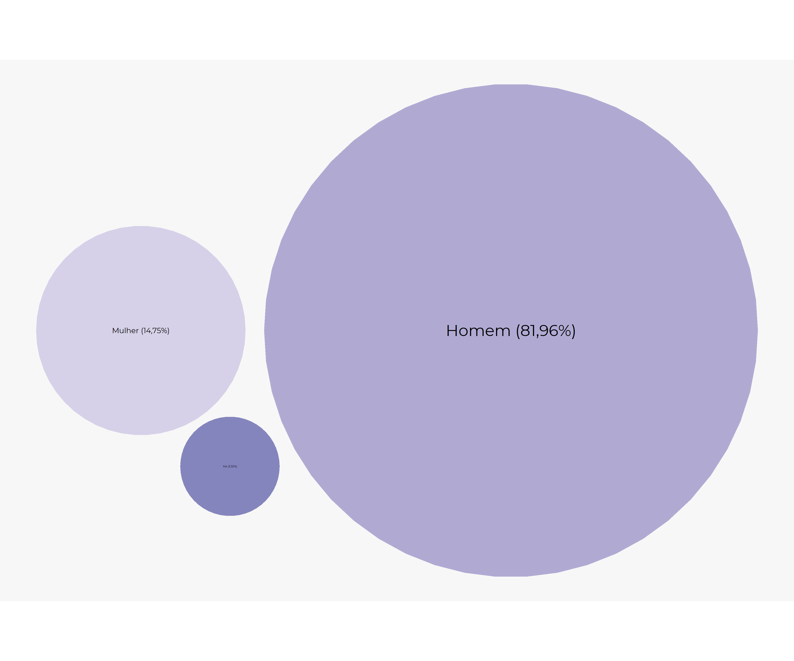
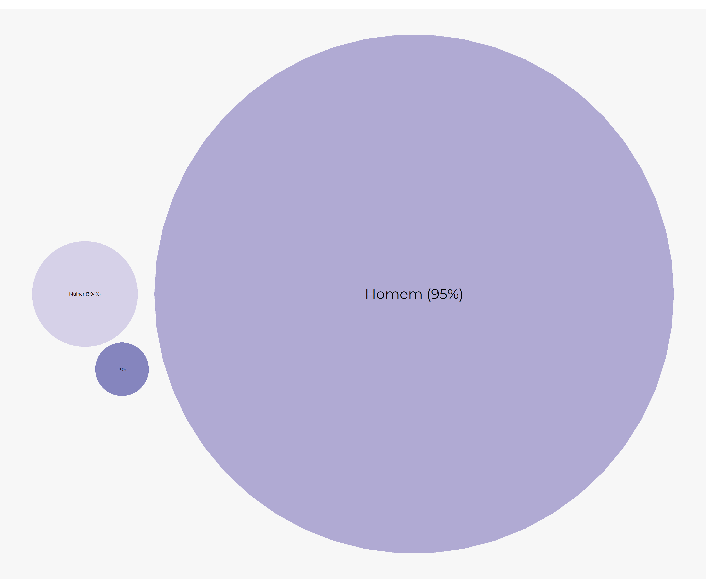
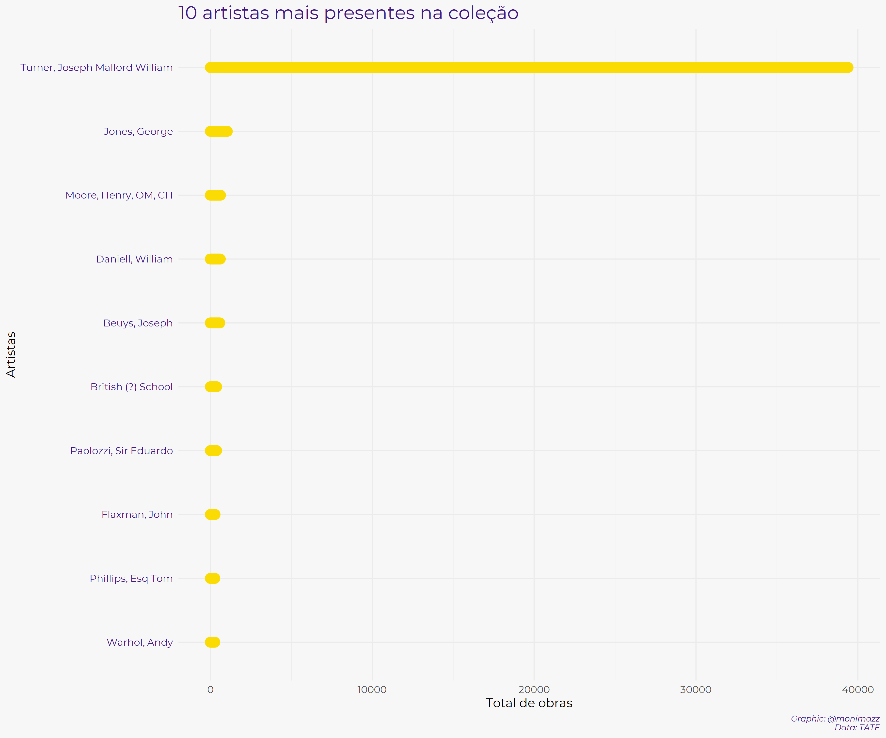
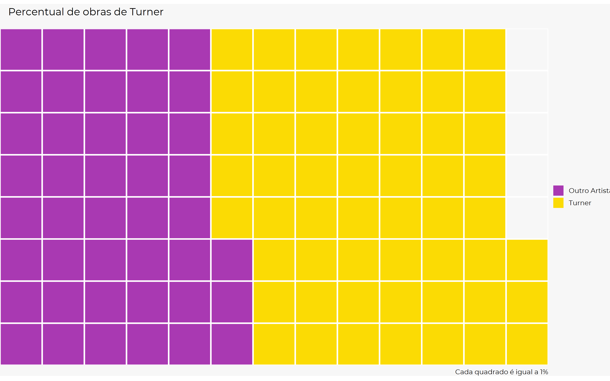
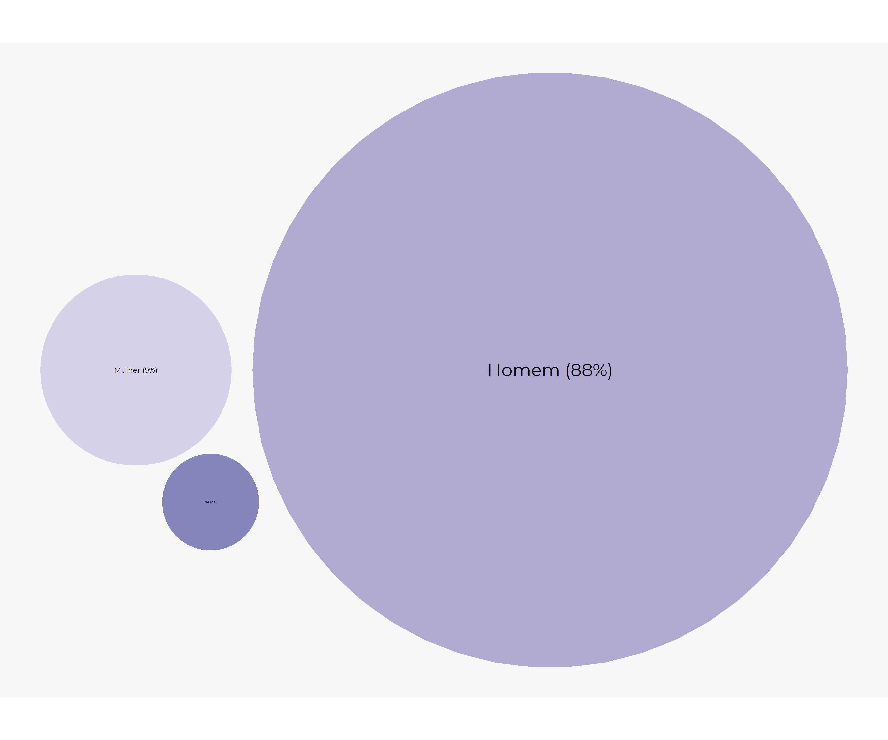
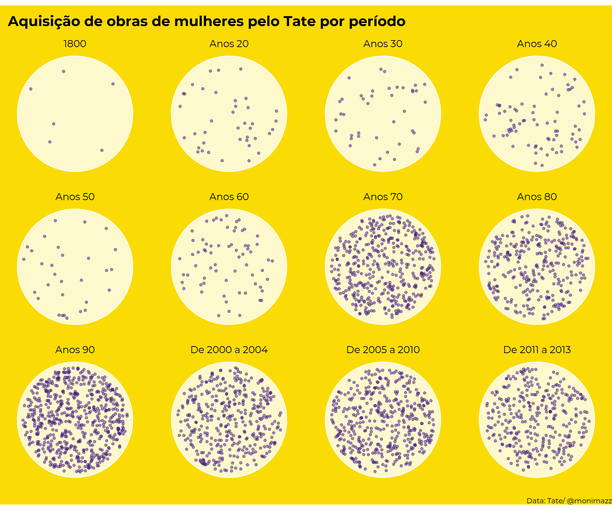
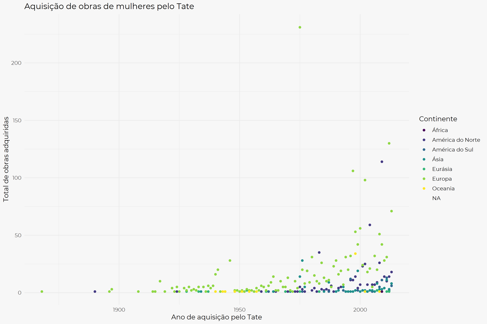
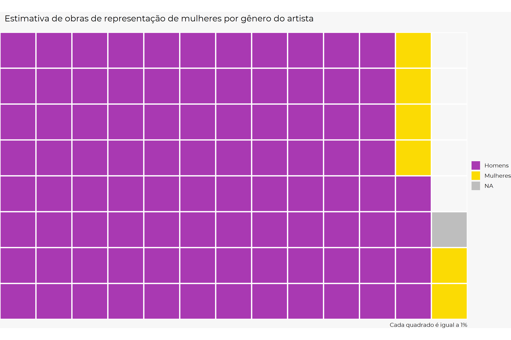

```{r, include=FALSE, eval=FALSE}
extrafont::loadfonts(device="win")

library(tidyverse)

base_unida <- read.csv("~/R/base_unida.csv", encoding = "latin 1")
```

<center>


</center>

Sou uma pessoa apaixonada por arte, tudo desse universo me encanta, seja colocar a mão na massa, ou ler sobre história da arte, vida de artistas, etc. Através da arte conseguimos expressar sentimentos e ideias e levar o espectador a senti-las ou ter outras reações não esperadas.

Por conta desse interesse resolvi participar do meu primeiro Tidy Tuesday! A base de dados da terceira semana do ano é da coleção do Tate (composto por 4 galerias)! dentre elas, um dos maiores acervos de arte moderna do mundo. Para os novos na comunidade R, o tidy tuesday é um projeto contínuo que disponibiliza por semana diversas bases de dados para que se possa treinar organização e visualização de bases de dados, você encontra mais detalhes no [github do projeto](https://github.com/rfordatascience/tidytuesday).

## Debate sobre gênero e arte
Já percebeu quando você vai em museus que mulheres/feminilidade é um tema recorrente na arte? Quantos dessas obras são feitas por mulheres? Quanto o feminino e o ser mulher foi idealizado? 

Essas perguntas se tornaram mais presentes na minha vida após ir a uma exposição no MASP do grupo Guerilla Girls. O grupo nasceu em NY nos anos 80, com intuito de combater o sexismo e racismo no mundo da arte, você consegue identificar seus trabalho através da máscara de gorila, marca registrada o grupo.

Nessa exposição, me deparei com a seguinte imagem:


Os dados acima infelizmente não são uma exceção no mundo, as artistas mulheres possuem pouco espaço nesse mundo. Apesar do cenário estar sendo problematizado e progressivamente alterado, isso ainda é uma questão presente e necessária de ser debatida e analisada. Dessa forma, com as bases do Tate, decidi trazer esse olhar e tentar compreender:

## Perguntas

* Quantas são as artistas mulheres em relação ao total de artistas?
* Quanto % as artistas são presentes no acervo?
* Quando as artistas mulheres começaram a ser adquiridas pelo Tate?
* Qual a relação entre obras representando mulheres no Tate e artistas mulheres?


### Mão a obra!
Antes de começarmos as analises precisamos pegar essa base de dados, para isso é só instalar o pacote `tidytuesdayR` e baixar a semana das bases de dados de interesse.

```{r, message = FALSE, warning = FALSE, eval=FALSE}
library(tidyverse)
library(tidytuesdayR)

tuesdata <- tidytuesdayR::tt_load(2021, week = 3)

```

As bases de dados são referentes aos artistas e as obras, para trabalharmos com as nossas bases temos que tirá-las do formato de lista e colocar cada base como um dataframe
```{r, message=FALSE, warning=FALSE, eval=FALSE}
artistas <- tuesdata$artists
obras <- tuesdata$artwork
```

Respondendo minha primeira pergunta: Quanto % as mulheres representam entre os artistas?
```{r, warning=FALSE, message=FALSE, eval=FALSE}

library(packcircles)
data <- data.frame(group=paste(c("Mulher (14,75%)", "Homem (81,96%)", "NA (3,32%)")), value=c(14.75, 81.96, 3.32)) 

packing <- circleProgressiveLayout(data$value, sizetype='area')
packing$radius <- 0.95*packing$radius
data <- cbind(data, packing)
dat.gg <- circleLayoutVertices(packing, npoints=50)

# Plot 
ggplot() + 
  geom_polygon(data = dat.gg, aes(x, y, group = id, fill=id), alpha = 0.6) +
  geom_text(data = data, aes(x, y, size=value, label = group), color="black", family = "Montserrat") +
  theme_void() + 
  theme(legend.position="none")+ 
  coord_equal() +
  scale_fill_gradient2()
```



Ótimo! Para conseguir responder as perguntas que quero preciso unir as bases de artistas e obras, isto devido a base de obras não possuir o gênero dos artistas, somente o nome deles, logo vou usar o id do artista como dado em comum. 
_Detalhe importante: como quero a base mais completa possível, escolhi unir a base através das obras, que possui 69 mil linhas, enquanto de artistas possui 3 mil linhas._

```{r, message=FALSE, warning=FALSE, eval=FALSE}
base_unida <- left_join(obras, artistas, by = c("artistId" = "id"))
```


Para começar a nossa análise, qual a presença de mulheres artistas na coleção?
```{r, message=FALSE, warning=FALSE, eval=FALSE}
library(packcircles)
data <- data.frame(group=paste(c("Mulher (3,94%)", "Homem (95%)", "NA (1%)")), value=c(3.94, 95.04, 1.01)) 

packing <- circleProgressiveLayout(data$value, sizetype='area')
packing$radius <- 0.95*packing$radius
data <- cbind(data, packing)
dat.gg <- circleLayoutVertices(packing, npoints=50)

# Plot 
ggplot() + 
  geom_polygon(data = dat.gg, aes(x, y, group = id, fill=id), alpha = 0.6) +
  geom_text(data = data, aes(x, y, size=value, label = group), color="black", family = "Montserrat") +
  theme_void() + 
  theme(legend.position="none")+ 
  coord_equal() +
  scale_fill_gradient2()
```



Já começamos a ver algumas informações um pouco chocantes só com esse recorte, de 69 mil obras, o Tate possui somente 3 mil obras de artistas mulheres, ou seja, *mulheres representam 5% do acervo do Tate.*
Essa foi minha primeira reação:


No entanto, fiquei pensando, será que há algum artista mais presente na coleção que outros? Talvez isso possa explicar esse número tão baixo de artistas mulheres na coleção.

```{r, message=FALSE, warning=FALSE, eval=FALSE}
base_unida %>% 
  count(artist, sort = TRUE) %>% 
  top_n(10) %>%
  mutate(artist = fct_reorder(artist, n)) %>% 
  ggplot(aes(artist, n,)) +
  geom_segment(aes(xend = artist, yend = 0),color = "#FBDB04", lineend = "round", size = 5) +
  coord_flip() +
  theme_minimal(base_family = "Montserrat", base_size = 12) +
  theme(plot.background = element_rect(fill = "#F7F7F7", color = NA),
                     plot.title = element_text(size = 18, colour="#401A82"),
                    plot.caption = element_text(face = "italic", size = 8, colour="#401A82"),
        axis.text.y =element_text(colour="#401A82")) +
  labs(title = "10 artistas mais presentes na coleção", caption = "Graphic: @monimazz\nData: TATE", x = "Artistas", y = "Total de obras", color = "")

```



Como podemos ver há uma grande quantidade de obras de Turner no acervo, podemos melhor visualizar que ele representa mais de 50% do acervo! 
```{r, warning=FALSE, message=FALSE, eval=FALSE}
library(waffle)

tunerr <- c(`Outro Artista`=43.1, `Turner`=56.9) # fiz a conta separado para identificar esse valor

waffle(tunerr/1, rows=8, size=1, colors=c("#A939B2", "#FBDB04")) +
  labs(title = "Percentual de obras de Turner
       ", caption = "Cada quadrado é igual a 1%") +
  theme_void(base_family = "Montserrat", base_size = 12)

```



Refazendo a análise sem o Turner que é mais de 50% do acervo, chegamos a quase a mesma conclusão, mulheres representam *menos de 10% do acervo*. :sweat:
```{r, warning=FALSE, message=FALSE, eval=FALSE}

library(packcircles)
data <- data.frame(group=paste(c("Mulher (9%)", "Homem (88%)", "NA (2%)")), value=c(9.14, 88.5, 2.34)) 

packing <- circleProgressiveLayout(data$value, sizetype='area')
packing$radius <- 0.95*packing$radius
data <- cbind(data, packing)
dat.gg <- circleLayoutVertices(packing, npoints=50)

# Plot 
ggplot() + 
  geom_polygon(data = dat.gg, aes(x, y, group = id, fill=id), alpha = 0.6) +
  geom_text(data = data, aes(x, y, size=value, label = group), color="black", family = "Montserrat") +
  theme_void() + 
  theme(legend.position="none")+ 
  coord_equal() +
  scale_fill_gradient2()
```



Agora que sabemos o quanto as artistas mulheres representam menos de 10% no Tate, será que está havendo algum movimento de mudança para representação de mulheres na arte por parte do Tate? Para isso vamos precisar de uma base com recorte somente de mulheres

```{r, message=FALSE, warning=FALSE, eval=FALSE}
mulheres <- base_unida %>% 
  filter(gender == "Female") %>% 
    separate(placeOfBirth, into = c("Local", "Pais" ), sep = ", ")
```

```{r, include=FALSE, eval=FALSE}

mulheres <- mulheres %>% 
  mutate(Pais = case_when(Local == 'Bangladesh' ~ 'Bangladesh',
      Local == 'Bermondsey' ~   'Bermondsey', 
          Local == "Brasil" ~"Brasil",  
          Local == "Canada"  ~"Canada", 
 Local == "Ceská Republika"   ~ "Ceská Republika",  
        Local == "Colombia"     ~"Colombia",
     Local == "Deutschland"     ~"Deutschland",
        Local ==   "France"     ~"France",
          Local ==   "Îran"     ~"Îran",
         Local == "Jamaica"     ~"Jamaica",
Local ==     "Magyarország"    ~"Magyarország",
    Local == "México"     ~"México",
Local == "Montserrat"  ~"Montserrat",   
  Local ==  "Nihon"     ~"Nihon",
      Local == "Österreich" ~ "Österreich",
        Local == "Polska" ~ "Polska",
      Local =="Schlesien" ~ "Schlesien",
        Local =="Schweiz" ~ "Schweiz",
      Local =="Singapore"  ~ "Singapore",
  Local == "Taehan Min'guk"  ~ "Taehan Min'guk",
         Local == "Türkiye" ~ "Türkiye",
  Local == "United Kingdom" ~ "United Kingdom",
   Local == "United States" ~ "United States",
    Local ==   "Viet Nam"  ~ "Viet Nam",
      Local == "Yisra'el" ~ "Yisra'el",
        Local == "Zhonghua" ~ "Zhonghua",
        TRUE ~ as.character(.$Pais)),
Pais = as.character(Pais))

continentes <- readxl::read_excel("~/R/continentes.xlsx")

mulheres <- left_join(mulheres, continentes)
```


### Artistas mulheres no Tate
Quando as artistas mulheres começaram a ser adquiridas pelo Tate?
Para responder essa pergunta, me inspirei na visualização do mês de Janeiro de 2021  da cientista de dados e dataviz [Maia Pelletier](https://twitter.com/MaiaPelletier), para isso, segui o [script](https://github.com/MaiaPelletier/tidytuesday/blob/master/R/2021_Week02_GlobalTransitCosts.R) que ela disponibilizou em seu github. Tentei fazer em um estilo Yayoi Kusama, que sou fã de suas obras:
<center> 

</center> 


Como podemos perceber, a partir de 1970 começa uma aquisição mais intensa de obras mulheres artistas pelo TATE, para melhor visualizar a nacionalidade dessas mulheres e quem são, fiz o gráfico interativo abaixo _(Tinha feito esse gráfico, mas ele não está funcionando no site, então estará disponível no github)_


```{r, message=FALSE,warning=FALSE, eval=FALSE}
mulheres %>% 
  group_by(acquisitionYear, Continentess) %>% 
  summarize(n = n(),
            Região = Região[n],
            Artista = artist[n]) %>% 
  ungroup() %>% 
  ggplot(aes(x = acquisitionYear, y = n, color = Continentess,
             Artista=Artista, Região=Região)) +
  geom_point() +
  theme_minimal(base_family = "Montserrat", base_size = 12) +
  labs(x = "Ano de aquisição pelo Tate", y = "Total de obras adquiridas", color = "Continente",
       title = "Aquisição de obras de mulheres pelo Tate") +
  scale_color_viridis_d()
```




Outro ponto que fiquei refletindo após a exposição da Guerilla Girls é como a imagem da feminilidade e dar mulher foi criada e construída segundo a visão dos homens em relação ao que significava esses conceitos. Logo, a criação do imaginário do que é ser mulher, foi construído principalmente por artistas homens brancos, que em realidade nada sabem sobre o que é ser uma mulher. O debate sobre a construção e conceito desses conceitos é longa e há diversos estudos muito interessantes sobre isso (se tiver dicas de temas coloca nos comentários!) recomendo a leitura!

Em vista disso, como está estruturada a coleção do Tate? Qual a % de quadros com o tema "mulher" e "feminino"? *Quem nós representa?*

### As mulheres representadas nas obras - Quem produz essa imagem?

```{r, message=FALSE, warning=FALSE, eval=FALSE}
library(waffle)

representacao <- c(`Homens`=92, `Mulheres`=6.5, `NA` = 1.5) # fiz a conta separado para identificar esse valor

waffle(representacao/1, rows=8, size=1, colors=c("#A939B2", "#FBDB04", "grey")) +
  labs(title = "Estimativa de obras de representação de mulheres por gênero do artista
       ", caption = "Cada quadrado é igual a 1%") +
  theme_void(base_family = "Montserrat", base_size = 12)
```




### Considerações finais

Como podemos perceber há uma falta de representação de artistas mulheres, ainda que nas últimas décadas o TATE realizou um esforço para trazer artistas mulheres a suas galerias. Ainda há um longo caminho a percorrer, sempre se questione sobre a sociedade em que vive e os espaços de representação e poder, segue abaixo um vídeo do grupo Guerilla Girls, que além de explicar a origem traz algumas reflexões sobre o mundo da arte, recomendo muito assistir:

<center>
<iframe width="560" height="315" src="https://www.youtube.com/embed/8uKg7hb2yoo" frameborder="0" allow="accelerometer; autoplay; clipboard-write; encrypted-media; gyroscope; picture-in-picture" allowfullscreen></iframe>
</center> 


Foi uma experiência legal participar desse tidy tuesday, que me desafiou a pensar novas formas de visualização e aprender com o código da comunidade `R`, além de conhecer o trabalho de um pessoal incrível! Espero fazer mais vezes com temas tão interessantes.

