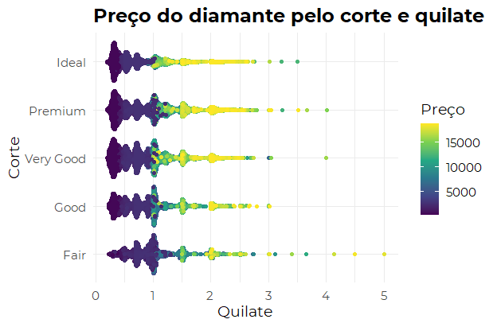
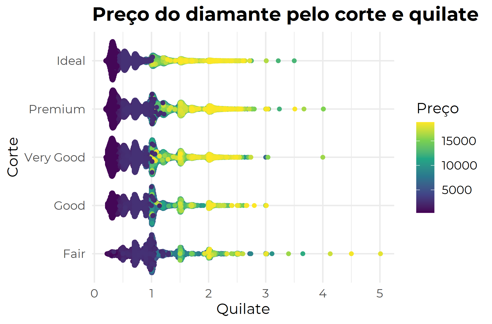

:pill: Dando início a série de pílulas de conhecimento! Apesar de entrar também em tutoriais, a ideia é trazer pequenas dicas que fazem toda diferença no dia a dia de quem programa. :pill:

Resolvi começar com algo que com frequência esqueço e me percebo SEMPRE voltando ao post de [William Chase](https://www.williamrchase.com/post/custom-fonts-and-plot-quality-with-ggplot-on-windows/), que vou aqui traduzir e escrever com as minhas palavras: APERFEIÇOANDO A VISUALIZAÇÃO DO GRÁFICO, ou como alterar/customizar a fonte do gráfico e melhorar a visualização de exportação.

## Customizar a fonte do gráfico
Para indicar fontes ou usar fontes customizadas você irá precisar do pacote `extrafont` e  `extrafontdb`.

### Passo a passo

* Instale as fontes que você deseja, recomendo o [Google Fonts](https://fonts.google.com/) 
* Instale as fontes no `R` com `extrafont::font_import()`. Esse passo só deve ser feito cada vez que você instalar uma fonte nova no seu computador e desejar usá-la no R.
* Restart sua sessão no R
* ANTES de começar a carregar os pacotes que você irá usar no R, carregue o seguinte comando `extrafont::loadfonts(device = "win")`. Isso deve ser feito TODA VEZ que você iniciar uma nova sessão no R.


## Exportar seu ggplot em boa qualidade

Você fez um gráfico m-a-r-a-v-i-l-h-o-s-o e aí quando chega a hora de divulgar ele, colocar no relatório ele fica todo pixelado ou em uma qualidade horrível? 




Demorei um tempo para descobrir que há uma forma de exportar sem perder a qualidade da imagem com o pacote `Cairo`! Você só precisa indicar ao salvar o seu arquivo que o tipo é igual a cairo: 

```{r, eval=FALSE}
ggsave("beautiful_plot.png", device = "png", type = "cairo"
```


## Exemplificando:




```{r, eval=FALSE}
extrafont::loadfonts(device = "win")
library(ggplot2)
library(magrittr)
library(ggbeeswarm)

diamonds %>% 
    ggplot() +
    geom_quasirandom(aes(x = cut, y = carat, color = price))+
    coord_flip() +
    theme_minimal(base_family = "Montserrat", base_size = 14)+ #aqui você escolhe a fonte
    labs(title = "Preço do diamante pelo corte e quilate", x = "Corte", y = "Quilate", color = "Preço") +
    theme(plot.title = element_text(size = 18, face="bold")) +
   scale_color_viridis_c()


ggsave("grafico_lindo.png", device = "png", type = "cairo")

```

